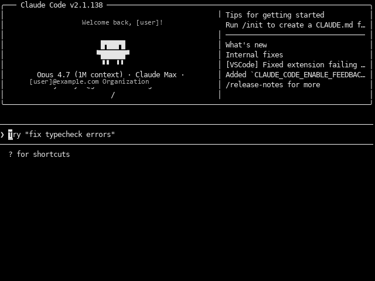

# AnberCC


**Claude Code w kieszeni.** SDL2-owy emulator terminala dla **Anbernic RG40XX V**, który odpala interaktywną sesję `claude` (Claude Code CLI) bez potrzeby SSH z laptopa. Pełnoekranowy, sterowany BT klawiaturą.



Dzięki niemu pracujesz z Claude Code wprost na konsoli — pisanie kodu, czytanie plików, używanie wszystkich narzędzi (Read, Write, Bash, Glob, Grep, Edit) — w trybie "in your hand".

## Możliwości

- Pełnoekranowy emulator terminala 640×480 oparty o `pyte`
- Renderowany przez SDL2 + PIL (działa wprost na DRM/KMS, bez X11)
- Scrollback historii (500 linii)
- Spawnuje `claude` w PTY — pełna kompatybilność z interaktywnym Claude Code
- Działa z BT klawiaturą lub klawiaturą USB OTG
- Integracja z App Center (`dmenu.bin`) — ikona w siatce aplikacji

## Wymagania

### Hardware

- **Anbernic RG40XX V** (Allwinner H700, 640×480 LCD landscape)
- **Klawiatura Bluetooth** (LUB USB OTG keyboard) — **wymagana**, bez niej nie wpiszesz nic do Claude. Konsola sama nie ma klawiatury fizycznej.
- Inne RG40-serii **mogą działać** — niesprawdzone

> **Uwaga o BT klawiaturze:** AnberCC nie zawiera własnego on-screen keyboard. Klawiatura BT (lub USB OTG) jest **konieczna** do interakcji z Claude. Konsola RG40XX V ma BT 5.0 i wspiera HID — działa praktycznie każda nowoczesna klawiatura BT (Logitech, Lenovo, Anker, generyczne). Dla wygody w terenie polecam mini-klawiatury 60% lub składane.

### Parowanie klawiatury BT na konsoli

Konsolę paruje się raz, BlueZ pamięta urządzenie. Najprościej z poziomu SSH przy pierwszym setup'ie:

```bash
ssh root@<IP-konsoli>
bluetoothctl
```

W shellu `bluetoothctl`:
```
power on
agent on
default-agent
scan on
```

Włącz klawiaturę BT w trybie pairing (zwykle przytrzymanie kombinacji typu `Fn+P` lub przycisku Bluetooth). Po kilku sekundach w listingu pojawi się jej MAC, np. `[NEW] Device AA:BB:CC:DD:EE:FF Logitech K380`.

```
pair AA:BB:CC:DD:EE:FF
trust AA:BB:CC:DD:EE:FF
connect AA:BB:CC:DD:EE:FF
quit
```

Po `connect` test: na konsoli powinieneś móc wpisywać litery (jeśli np. masz dmenu otwartą gdzieś gdzie wprowadzasz tekst).

> **Niektóre klawiatury** (np. Logitech K380, Lenovo) używają **per-pair-mode rotation MAC** — przy pierwszym sparowaniu zapisują nowy MAC dla tego hosta. Jeśli już sparowałeś klawiaturę z laptopem/telefonem, na Anbernicu może mieć inny MAC. Naciśnij dłużej przycisk Fn+1/2/3 (zależy od modelu) żeby przełączyć "slot" pairing przed parowaniem z konsolą.

Po sparowaniu klawiatura BT auto-łączy się przy każdym kolejnym uruchomieniu konsoli. Stan sprawdzisz przez:
```bash
bluetoothctl info AA:BB:CC:DD:EE:FF
# Connected: yes/no
```

Jeśli nie auto-łączy: w `bluetoothctl` → `connect AA:BB:CC:DD:EE:FF` lub przełóż przełącznik BT na klawiaturze off/on.

### Firmware

Tworzone i testowane na **stock Anbernic firmware build `20251225`**:
- Ubuntu 22.04.x LTS (Jammy)
- Kernel `4.9.170` (Allwinner H700 BSP)
- App Center: `dmenu.bin` (vendor)
- File: `/mnt/vendor/oem/version.ini` → `20251225`
- File: `/mnt/vendor/oem/board.ini` → `RG40xxV`

Inne firmware (muOS, Knulli, garlicOS) — niesprawdzone.

### Claude Code CLI + logowanie

Wymagany **claude** CLI z aktywną subskrypcją Anthropic (testowane z **Claude Max**, działa też z **Claude Pro** lub kluczem API).

#### Krok 1: Zainstaluj Node.js (jeśli brakuje)

```bash
apt update && apt install -y nodejs npm
```

#### Krok 2: Zainstaluj Claude Code

```bash
npm install -g @anthropic-ai/claude-code
```

Sprawdź:
```bash
which claude       # /root/.local/bin/claude lub /usr/local/bin/claude
claude --version
```

#### Krok 3: Zaloguj się — **rób to przez SSH, NIE z poziomu AnberCC**

Logowanie wymaga otwarcia URL w przeglądarce. Najprościej:

1. **Połącz się z konsolą po SSH z laptopa**:
    ```bash
    ssh root@<IP-konsoli>
    ```

2. **Uruchom logowanie**:
    ```bash
    claude /login
    ```
    (Claude Code wewnątrz interaktywnej sesji ma slash command `/login`. Możesz też wpisać `claude` żeby otworzyć sesję, potem `/login`).

    Wybierz tryb logowania (np. `Claude Max account`, `Anthropic API key`, etc.).

3. **Otwórz URL** który Claude wyświetli (długi link `https://claude.ai/...`) — wklej do przeglądarki na laptopie/telefonie. Zaloguj się do swojego konta Anthropic.

4. **Skopiuj kod autoryzacyjny** z przeglądarki, wklej w terminalu SSH gdzie czeka prompt.

5. **Zatwierdź** — Claude zapisze token OAuth w `/root/.claude/credentials.json`.

#### Krok 4: Test

```bash
echo "powiedz hej" | claude -p
```

Powinieneś dostać krótką odpowiedź. Jeśli tak — AnberCC będzie działać natychmiast.

#### Alternatywa: klucz API

Jeśli wolisz nie używać OAuth (nie potrzebujesz subskrypcji Max), tylko klucza API:

```bash
echo 'export ANTHROPIC_API_KEY="sk-ant-..."' >> /root/.bashrc
source /root/.bashrc
```

Następnie:
```bash
claude --bare -p "test"
```

> **Uwaga:** AnberCC domyślnie używa Claude Code w trybie OAuth (Max/Pro). Jeśli masz tylko klucz API, edytuj `app/main.py` żeby dodać `--bare` do polecenia spawn-ującego `claude`.

#### Gdzie jest token?

Po pierwszym `claude login` token OAuth znajduje się w `/root/.claude/`. NIE COMMITUJ tej ścieżki nigdzie — zawiera dane uwierzytelniające twojego konta Anthropic.

```bash
ls -la /root/.claude/
# credentials.json — tu jest token, plik chroń
```

AnberCC odpala `python3 main.py` które spawnuje `claude` w PTY, dziedzicząc dostęp do `/root/.claude/`.

### System packages

Stock firmware `20251225` już zawiera wszystko. Jeśli czegoś brakuje:
```bash
apt update
apt install python3 python3-pip libsdl2-2.0-0 fonts-dejavu nodejs npm
```

| Pakiet | Wersja stock | Rola |
|---|---|---|
| `libsdl2-2.0-0` | 2.0.20 | renderer |
| `python3` | 3.10.x | runtime |
| `fonts-dejavu` (DejaVuSansMono.ttf) | systemowy | font UI |
| `nodejs` + `npm` | dla `@anthropic-ai/claude-code` |

### Python packages

| Pakiet | Wersja testowana | Rola |
|---|---|---|
| `pysdl2` | 0.9.17 | bindings do SDL2 |
| `pyte` | 0.8.2 | emulator terminala (VT100/xterm) |
| `pillow` (PIL) | 12.2.0 | rysowanie do bufora |

Instalacja:
```bash
pip install pysdl2 pyte Pillow
```

## Instalacja

```bash
git clone https://github.com/karolfurtak/AnberCC.git
cd AnberCC
./scripts/install.sh
```

Skrypt:
- Kopiuje `app/main.py` do `/mnt/mmc/Roms/APPS/anbercc/main.py`
- Kopiuje launcher do `/mnt/mmc/Roms/APPS/AnberCC.sh`
- Generuje ikonę PNG do `/mnt/mmc/Roms/APPS/Imgs/AnberCC.png`

Po instalacji **AnberCC** pojawi się w App Center na konsoli. Uruchom, sparuj BT klawiaturę (jeśli nie sparowana), pisz `>>> ` jak w zwykłym terminalu.

## Katalog roboczy Claude Code (cwd)

AnberCC odpala `claude` przez `os.execve` w PTY — sesja **dziedziczy katalog roboczy** od launchera. Standardowo:

- **Launcher (`AnberCC.sh`)** robi `cd "$CC_WORKDIR"` przed startem Pythona, gdzie domyślnie `CC_WORKDIR=/root` (HOME)
- Z tego katalogu `claude` startuje sesję — domyślny prompt pokazuje `~`
- Claude czyta `~/.claude/CLAUDE.md` (jeśli istnieje) — możesz tam zapisać własne instrukcje globalne
- Komendy `Read`, `Glob`, `Bash` operują z tego cwd jako bazy

### Zmiana katalogu roboczego

**Stała zmiana** — edytuj `AnberCC.sh`:
```bash
# Przykład: zawsze otwiera w katalogu sprawozdań
CC_WORKDIR="/mnt/data/sprawozdania"
```

**Tymczasowa** — z poziomu sesji Claude Code w AnberCC po prostu:
```
> użyj Bash żeby cd /mnt/data/projekt-x i potem przeczytaj README
```

Claude wykona `cd` w swojej Bash sesji.

**Per-uruchomienie z SSH** — możesz odpalić AnberCC.sh z dowolnym katalogiem:
```bash
ssh root@<IP-konsoli> "CC_WORKDIR=/mnt/data/sprawozdania /mnt/mmc/Roms/APPS/AnberCC.sh"
```
*(Ale wtedy SDL nie wystartuje — apka SDL musi działać na lokalnym DRM, nie zdalnie. Używaj edycji `AnberCC.sh` zamiast.)*

### Co Claude widzi w `/root`

Domyślnie:
- `/root/.claude/credentials.json` — token OAuth (Claude Code czyta sam, ty nie ruszaj)
- `/root/.claude/CLAUDE.md` — twoje globalne instrukcje (jeśli utworzysz)
- nic innego specjalnego

Jeśli chcesz aby Claude od razu widział pliki sprawozdań, ustaw `CC_WORKDIR="/mnt/data/sprawozdania"` w launcherze. Jeśli wolisz żeby wybrał Claude sam — zostaw `/root` i powiedz mu w sesji "popracuj nad projektem w /mnt/data/sprawozdania/projekty/lab-3" — Claude przeskoczy.

## Sterowanie

Po uruchomieniu masz pełnoekranowy terminal. Wszystkie znaki idą do `claude` przez PTY. Możesz sterować równolegle **gamepadem konsoli** ORAZ **BT klawiaturą** — działają obok siebie.

### Gamepad konsoli

| Element | Akcja w terminalu Claude |
|---|---|
| **D-pad ↑/↓/←/→** | Strzałki ↑↓←→ (nawigacja w prompt history Claude, edycja linii) |
| **A** (BTN_SOUTH, code 304) | **Enter** — wyślij polecenie do Claude |
| **B** (BTN_EAST, code 305) | **Escape** — anuluj pole edycji / cofnij |
| **X** (BTN_NORTH, code 307) | **Tab** — autouzupełnianie ścieżek/komend Claude |
| **L1** (BTN_TL, code 310) | **Page Up** — przewiń w górę o stronę |
| **R1** (BTN_TR, code 311) | **Page Down** — przewiń w dół o stronę |
| **SELECT** (BTN_SELECT, code 314) | **Ctrl+C** — przerwij bieżącą operację Claude |
| **Prawy analog ↑** | **Scroll UP** — przewijanie historii terminala (scrollback do 500 linii) |
| **Prawy analog ↓** | **Scroll DOWN** — powrót do bieżącej linii |

> **Analog scroll:** trzymaj prawy analog w górę żeby scrollować view. Powtarza się co 150 ms — szybkie ślizganie po długich outputach Claude (np. listing setek plików, długie sprawozdania). Strefa nieczułości (deadzone) 1200 — drobne ruchy ignorowane.

### BT klawiatura

| Klawisz | Akcja |
|---|---|
| **Litery / cyfry / symbole** | Pisane wprost do Claude (z obsługą Shift, AltGr, polskich znaków) |
| **Enter** | Wyślij linię |
| **Backspace** | Usuń znak |
| **Strzałki ↑↓←→** | Nawigacja edycji / prompt history |
| **Tab** | Autouzupełnianie |
| **Page Up / Page Down** | Scrollback historii |
| **Ctrl+C** | Przerwij Claude (SIGINT) |
| **Ctrl+D** | Zakończ sesję (EOF) — Claude wyjdzie, AnberCC też się zamknie |
| **Ctrl+L** | Wyczyść ekran |
| **Ctrl+A / Ctrl+E** | Początek / koniec linii |
| **Ctrl+W** | Usuń słowo wstecz |
| **Esc** dwukrotnie | Wyjście awaryjne (jeśli sesja zawiśnie) |

### Tipy praktyczne

- **Wpisywanie po polsku** — BT klawiatura z układem PL działa od razu (SDL_TextInput honoruje system layout). Jeśli klawiatura ma układ EN, polskie znaki zrobisz przez AltGr+a/e/o/s/n/c/x/z/l (typowy mac/PC układ "Polish programmers")
- **Skopiowanie outputu** — AnberCC nie ma kopiowania do clipboard (brak X11). Workaround: scrollback przez analog do interesującego fragmentu, potem zrób screenshot przez SSH (`/dev/fb0` → PNG)
- **Resetowanie sesji** — `Ctrl+C` × 2 + `clear` (Ctrl+L) szybciej niż restart całego AnberCC
- **Długie polecenia** — pisz na BT KB (klawiatura), wysyłaj A na gamepadzie (jak Enter) — wygodniej niż reach do Enter na klawiaturze trzymając konsolę w obu rękach

## Logi

- `/mnt/data/anbercc.log` — stdout / błędy launchera

## Licencja

MIT — patrz [LICENSE](LICENSE).

## Powiązane

- [Anbernet](https://github.com/karolfurtak/Anbernet) — manager WiFi (D-pad + on-screen klawiatura)
- AnberMon — monitor systemowy (CPU/RAM/Temp/Bat + wykresy + Discord activity)
- AnbernBot — Discord bot z Claude Code do tworzenia sprawozdań
